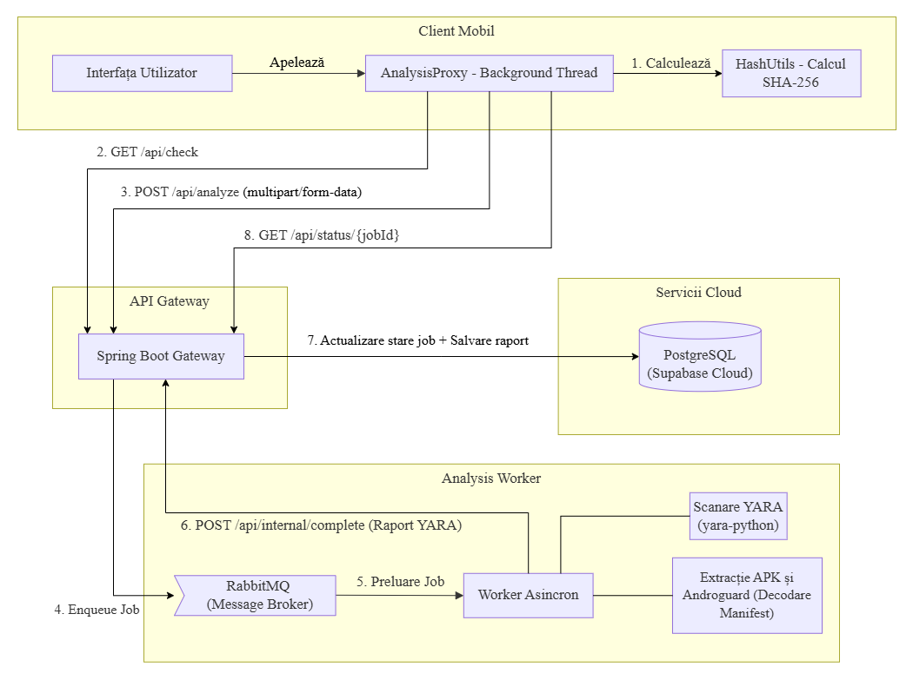
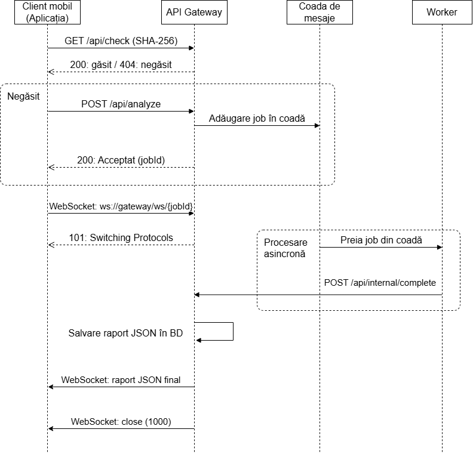

  
  <h1 align="center">DroidGuard</h1>
  

    <strong>Distributed System for Android Static Security Analysis</strong>
  

---

##  About the Project
**DroidGuard** is a distributed software system dedicated to the static security analysis of Android applications. The platform's main goal is to provide users with a fast and intuitive solution for detecting potential threats (malware, abusive permissions, malicious code) directly from their mobile devices.

The technical complexity of security analysis is abstracted behind a simple interface, while the actual analysis is delegated to a scalable cloud infrastructure.

---

##  System Architecture

The system is built on a 3-tier architecture, designed to separate the user interface from the asynchronous processing of complex files:

### 1. Mobile Client (Android / Java)
* Manages the graphical interface and user interaction.
* Extracts the APK files of installed applications (excluding system packages).
* Asynchronously calculates the local **SHA-256** hash to prevent re-uploading already analyzed apps.
* Uploads files via `HttpURLConnection` (`multipart/form-data` with chunking) to prevent Out Of Memory errors.
* Stores the analysis history in a local database (**SQLite / Room**).

### 2. API Gateway (Spring Boot / Java)
* Acts as a central orchestrator for task routing.
* Exposes REST endpoints for validations and queries.
* Uses **RabbitMQ** for asynchronous task publishing.
* Manages global data persistence in the cloud via **Supabase (PostgreSQL)**.
* Maintains a **WebSocket** connection with the client for real-time notifications.

### 3. Analysis Worker (Python)
* Asynchronously consumes tasks from the RabbitMQ queue.
* Decompiles files using `Androguard` and processes the `AndroidManifest.xml` binary.
* Executes the deterministic rule-based scanning engine with **YARA-Python**.
* Extracts heuristics (Shannon entropy, dangerous permissions, malicious API calls).
* Calculates a risk score (between 0.0 and 1.0) by corroborating evidence and returns the verdict.

---

## Execution Flow

Real-time communication between the client and server is optimized via WebSockets, eliminating the need for HTTP polling.

---

## Key Capabilities
* **Local App Extraction:** Identifying and packaging on-device installed applications.
* **Bandwidth Optimization:** Instant history verification via SHA-256 hashing.
* **Background Processing:** Stable connection and persistent status bar notifications even when the app is minimized.
* **Concurrent Scanning:** Multi-threading implemented in the Python worker for accelerated YARA scanning.
* **Multilingual Support:** Full interface in English and Romanian.

---

## User Interface

The design is minimalist, focusing on clarity. The user can search for applications, cancel active scans, and filter the history.

  
  &nbsp;&nbsp;&nbsp;
  
  &nbsp;&nbsp;&nbsp;
  

---

## Testing and Evaluation

The system was tested on commercial applications as well as manually built malicious applications (Proof of Concept) with varying degrees of severity:

| App Version | Inserted Indicators | Verdict | Score | Image |
| :--- | :--- | :---: | :---: | :---: |
| **V1 (Low Severity)** | Suspicious declared permissions (Boot, SMS), but unused. | `CLEAN` | **0.15** |  |
| **V2 (Medium Severity)** | Hardcoded SMS calls (`SmsManager`) + Base64 obfuscation. | `CLEAN` | **0.30** |  |
| **V3 (Critical Severity)**| Root execution (`su`), `DexClassLoader` (dropper), C2 addresses. | `SUSPICIOUS` | **1.0** |  |

---

## Technologies Used

* **Frontend (Mobile):** Android SDK, Java, Room (SQLite), WebSockets, XML.
* **Gateway Backend:** Java, Spring Boot, Spring Data JPA, RabbitMQ.
* **Worker Backend:** Python, Androguard, YARA, Pika (RabbitMQ client).
* **Database:** PostgreSQL (hosted on Supabase).
* **Architecture / Infrastructure:** Docker (optional, for running RabbitMQ/Worker instances).

---